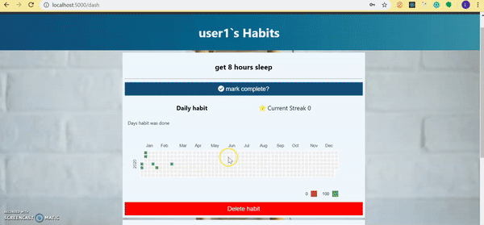

# Habit

This application allows users to track actions and create new habits!



### User stories

- As a user, when I want to start & track habits, I want an application that will help me do so.
- As a user, when I track my habits, I want an account to help me do so
- As a user, when I want to create an account, I want a form that will let me enter my unique username and password to create my account
- As a user, if I try to create an account with an existing username, I want to be notified that the username is in use
- As a user, when I want to log in, I want a form that lets me enter my credentials
- As a user, when I log in to my account, I want to see my existing habits
- As a user, when I see my habits, I want to be able to log that I have done it
- As a user, when I see my habits, I want to see if I have a streak of completing the habit
- As a user, when I want to delete a habit, I want a button that allows me to delete it
- As a user, when I want to add a habit, I want to be able to specify the habit at the frequency at what I want to complete it and a button to add the habit
- As a user, when I am done using the app, I want to be able to log out of my account

## Getting Started

Instructions to get this project up and running on your local PC for development and testing purposes.

### Installing

- Open the terminal in the project directory and write this command line.

```
git clone https://github.com/lawcia/habit.git
```

```
npm install
```

this installs all the npm dependencies for this project

then cd to client/ and npm install to install dependicies for the client side

```
npm test
```

this runs automated tests to make sure that the application can run without errors


### Testing
In the terminal run
```
npm test
```
This runs automated tests to make sure that you can connect to the database


### Running the project
In the terminal type
```
npm start
```
This starts the express server.

By default the website will run on port 5000

Go to http://localhost:5000/ in the browser. You should now see the website.

## Seed the database

To seed the database go to: http://localhost:5000/api/v1/seed 

This will seed database habits_db with two collections Users and Habits.

### Contributors:
Lawrencia ([@lawcia](https://github.com/lawcia "Lawrencia's Github")) |
Brian M ([@chipembere](https://github.com/chipembere "Brian's Github")) | Aaron ([@AaronM97](https://github.com/AaronM97 "Aaron's Github")) 

